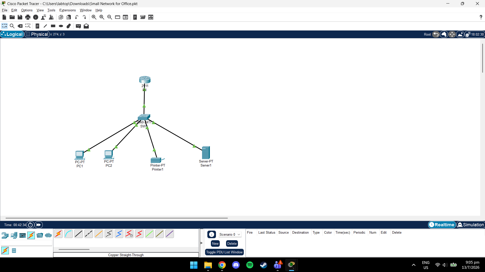
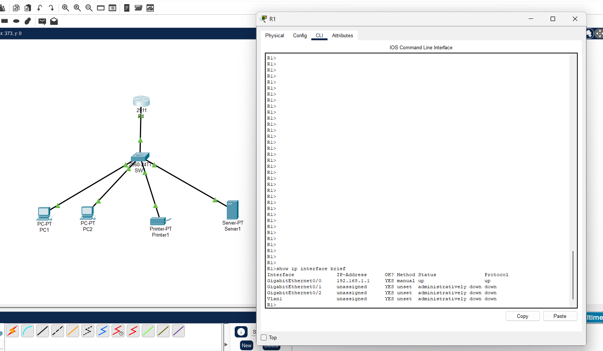
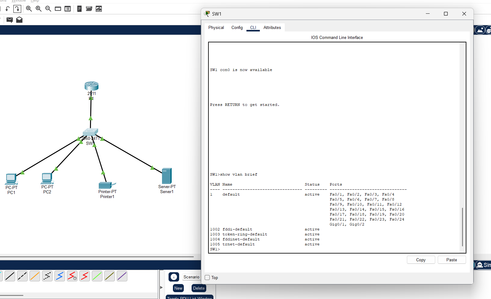
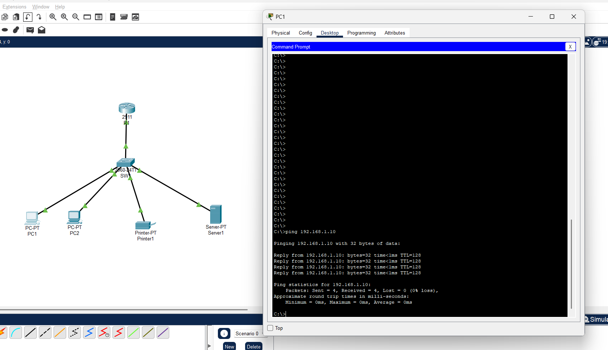
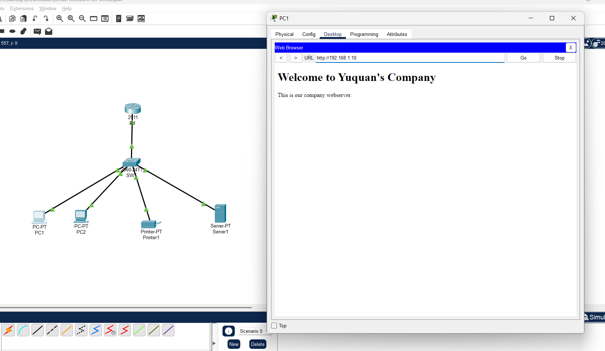

Small Office Network - Cisco Packet Tracer

## Overview

This project is a simulation of a small office local area network using Cisco Packet Tracer. The network includes a Cisco router, Cisco switch, two client PCs, a network printer, and a web server.

## Objectives

- Build a functional office LAN
- Configure Cisco router and switch
- Assign static IP addresses
- Configure a web server
- Verify network connectivity

## Network Topology

```
            R1
             │
           SW1
 ┌────────┬────────┬────────┬
 │        │        │        │
PC1     PC2    Printer   Server
```

## Devices

- Cisco 2911 Router
- Cisco 2960 Switch
- 2 PCs
- Printer
- Web Server

## IP Address Table

  | Device | IP Address |
|----------|----------------|
| Router   | 192.168.1.1    |
| Switch   | 192.168.1.2    |
| Server   | 192.168.1.10   |
| Printer  | 192.168.1.20   |
| PC1      | 192.168.1.101  |
| PC2      | 192.168.1.102  |

## Skills Demonstrated

- Cisco IOS CLI
- Router Configuration
- Switch Configuration
- IPv4 Addressing
- Static Routing Fundamentals
- Network Troubleshooting
- Web Server Configuration
- Connectivity Testing

## Testing

- Successful ping between all devices
- Web server accessible from client PCs

## Screenshots

### Network Topology



### Router Configuration



### Switch Configuration



### Ping Test



### Company Website


